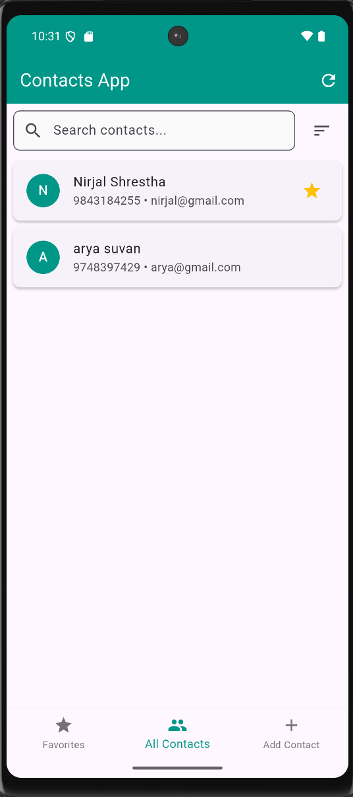
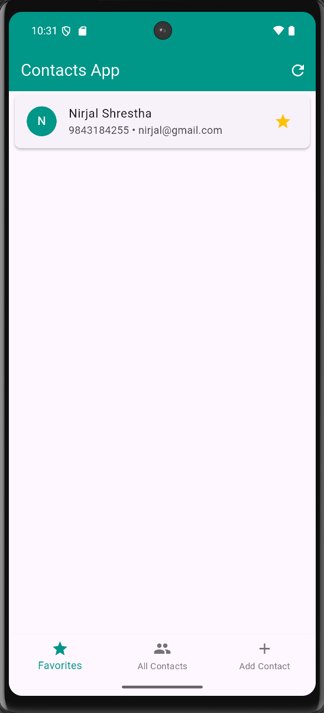
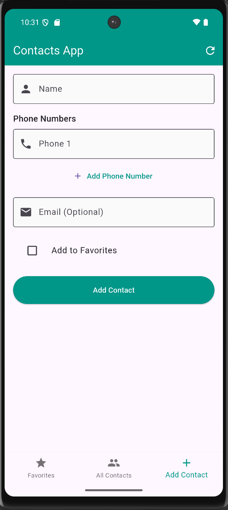

# 📱 Contacts App

A Flutter application for managing contacts using **sqflite** as the local database.

---

## ✨ Features

- View all saved contacts
- Add new contacts
- Edit existing contact details
- Mark/unmark favorite contacts
- Delete contacts
- Uses `sqflite` for local storage

---

## 🖼️ Screenshots

| All Contacts                                   | Favorites                                 | Add Contact                                   | Edit Contact                      |
|------------------------------------------------|-------------------------------------------|-----------------------------------------------|-----------------------------------|
|  |  |  |  |

---

## 🛠️ Tech Stack

- Flutter
- Dart
- Sqflite
- Path Provider

---

## 🚀 Getting Started

```bash
git clone https://github.com/Nirjal-shrestha14/contacts_app.git
cd contacts_app
flutter pub get
flutter run
